# Mockly

**AI-powered mock interviews that score every answer and track your readiness.**

Mockly is a mobile app that simulates technical job interviews using AI. You answer questions by typing or voice, get instant structured feedback with scores and improvement tips, and track your readiness over time across topics like JavaScript, React, React Native, Backend, and System Design.

---

## Features

- **Adaptive AI interviews** — Groq LLM generates questions tuned to your role (Frontend, Backend, React Native) and experience level (Junior, Middle, Senior). Difficulty adjusts dynamically based on your previous answers.
- **Three session modes** — Text (type at your own pace), Voice (speak your answer, AI transcribes), and Rapid Drill (fast-fire short answers).
- **Instant per-answer feedback** — every answer is scored 0–10 across Structure, Technical accuracy, and Clarity, with a list of strengths and concrete improvement points.
- **Readiness score** — a personal interview readiness index that grows as you practice. Each session updates your score and shows the delta.
- **Topic mastery tracking** — Progress screen shows your score trend over time and per-topic mastery (Excellent / Developing / Weak).
- **Session history** — filterable log of every session with type, topic, question count, duration, and score.
- **Question bank** — browse all questions that appeared in your sessions, filterable by topic.
- **Daily reminder** — configurable push notification to keep your streak going.

---

## Tech Stack

| Layer | Technology |
|---|---|
| Mobile | Expo 56 / React Native 0.85 |
| Navigation | Expo Router (file-based) |
| State | Zustand + React Query |
| Backend | Node.js / Express (TypeScript) |
| Database | Supabase (PostgreSQL + Row Level Security) |
| Auth | Supabase Auth (JWT RS256, email OTP) |
| AI | Groq API (LLaMA 3) |
| Shared types | `@mockly/shared` (internal monorepo package) |
| Monorepo | npm workspaces |

---

## Project Structure

```
Mockly/
├── apps/
│   ├── backend/          # Express API server
│   │   ├── src/
│   │   │   ├── controllers/
│   │   │   ├── routes/
│   │   │   ├── services/
│   │   │   ├── middleware/
│   │   │   └── config/
│   └── mobile/           # Expo app
│       ├── app/          # Expo Router screens
│       │   ├── (tabs)/   # Home, History, Progress, Profile
│       │   └── session/  # Interview flow
│       ├── components/
│       ├── hooks/
│       ├── stores/       # Zustand stores
│       └── utils/
└── packages/
    └── shared/           # Shared TypeScript types
```

---

## Getting Started

### Prerequisites

- Node.js 20+
- Expo CLI (`npm install -g expo-cli`)
- Supabase project
- Groq API key

### Environment Variables

**`apps/backend/.env`**
```env
PORT=3000
SUPABASE_URL=
SUPABASE_SERVICE_ROLE_KEY=
SUPABASE_JWT_SECRET=
GROQ_API_KEY=
ALLOWED_ORIGINS=http://localhost:8081
```

**`apps/mobile/.env`**
```env
EXPO_PUBLIC_API_URL=http://localhost:3000
EXPO_PUBLIC_SUPABASE_URL=
EXPO_PUBLIC_SUPABASE_ANON_KEY=
```

### Install & Run

```bash
# Install all dependencies
npm install

# Start the backend
cd apps/backend && npm run dev

# Start the mobile app (new terminal)
cd apps/mobile && npx expo start
```

---

## App Walkthrough

### 1. Sign In

Email/password login with Supabase Auth.

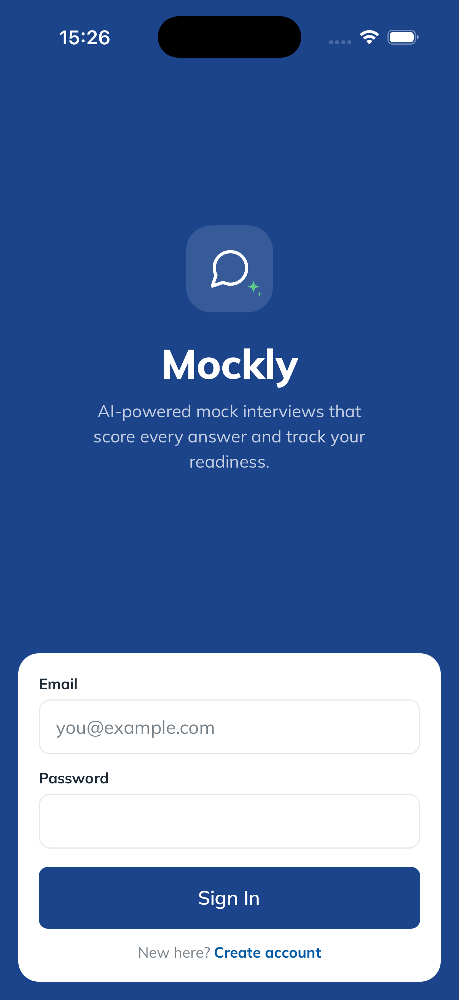

---

### 2. Email Verification

On first sign-up, a one-time code is sent to confirm the email address.

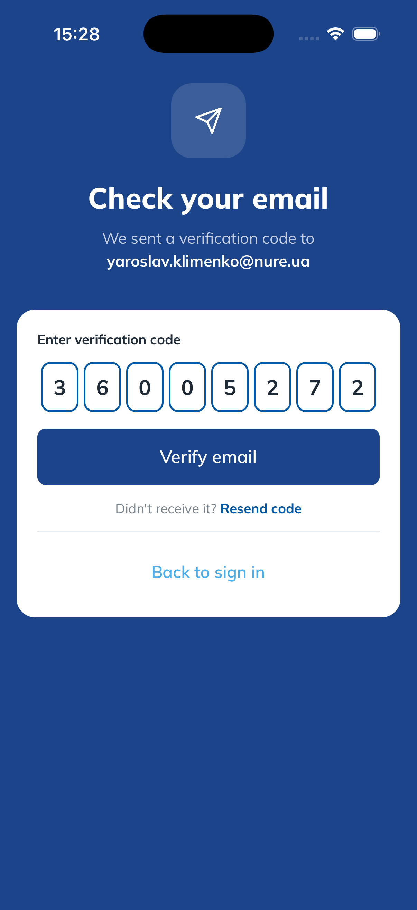

---

### 3. Onboarding — Set Your Target

Pick your role and experience level. The AI uses this to calibrate question difficulty and topic mix for every session.

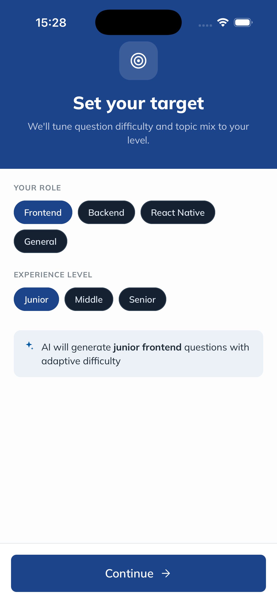

---

### 4. Home

Your interview readiness score at a glance, today's weakest topic to drill, and a log of recent sessions.

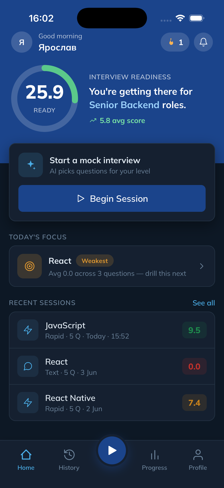

---

### 5. Start a New Session

Choose the session mode (Text / Voice / Rapid Drill), pick a topic, and set how many questions you want.

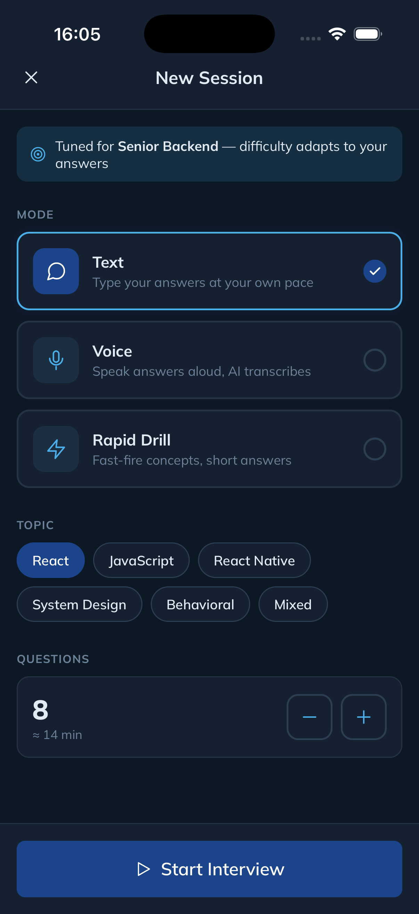

---

### 6. Answer a Question

The AI generates a question with tags and an estimated answer time. A progress bar and timer keep you on track.

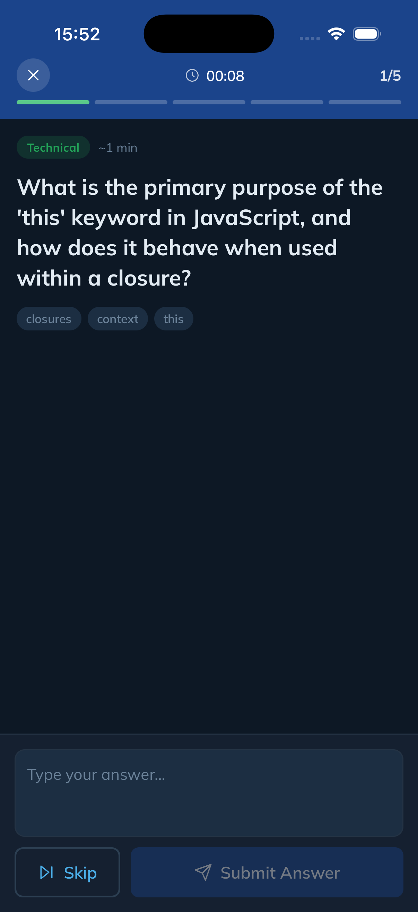

---

### 7. AI Feedback

After each answer you get an instant score (0–10) broken down into Structure, Technical, and Clarity, plus bullet-point strengths and one area to improve.

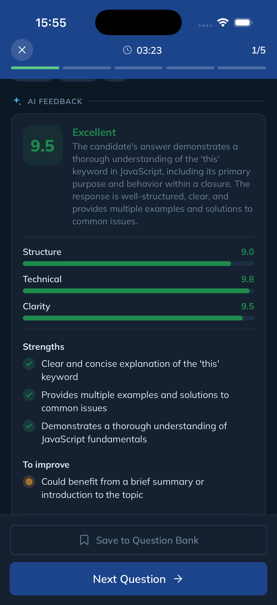

---

### 8. Session Results

When the session ends you see your overall score, readiness delta, and per-question scores as a bar chart.

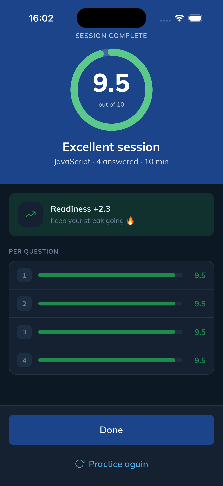

---

### 9. History

A full log of every session, filterable by mode (Text / Voice / Rapid). Tap any row to review it.

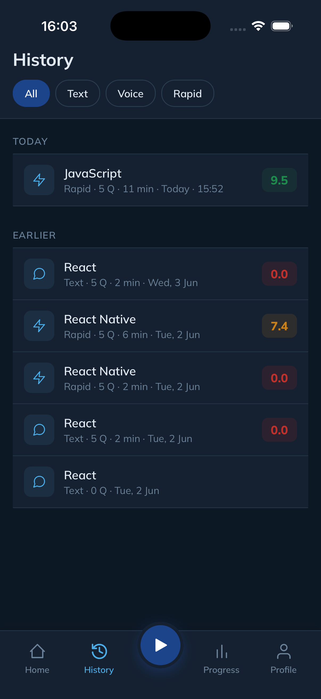

---

### 10. Progress

Score trend over your last sessions and topic mastery breakdown — shows which subjects are strong and which need work.

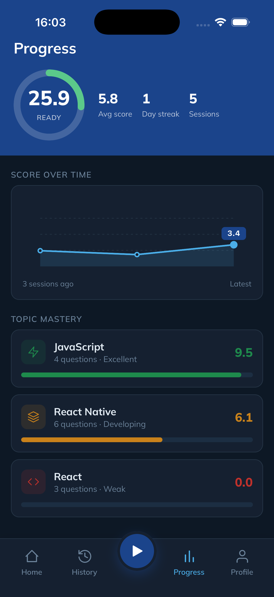

---

### 11. Question Bank

Browse all questions from your sessions, filterable by topic. Save a question to revisit it later.

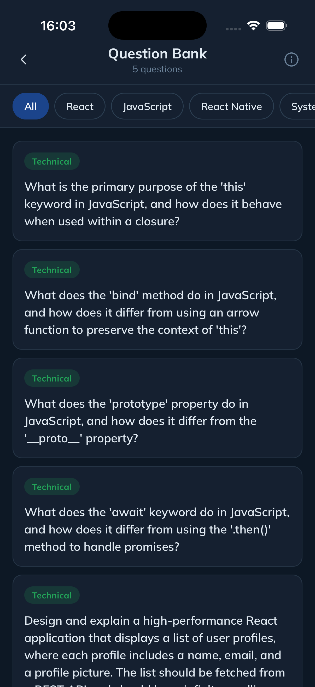

---

### 12. Profile

Your role, level, daily streak, and average score. Configure daily reminders and navigate to Settings.

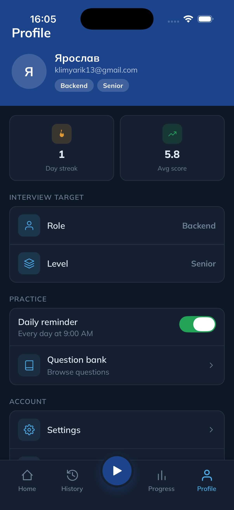
